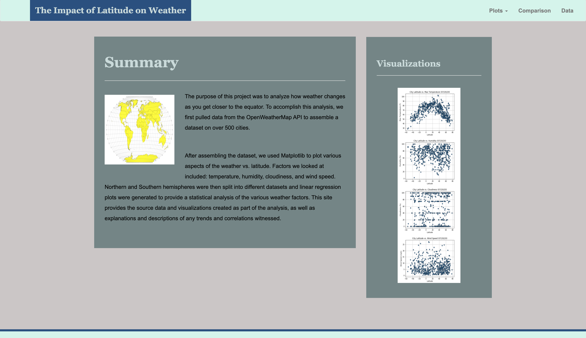
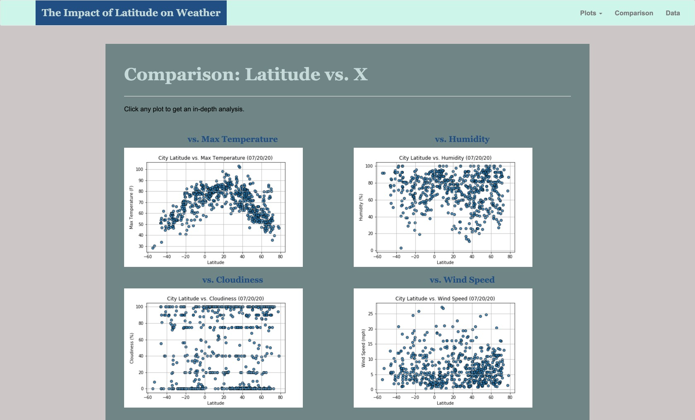
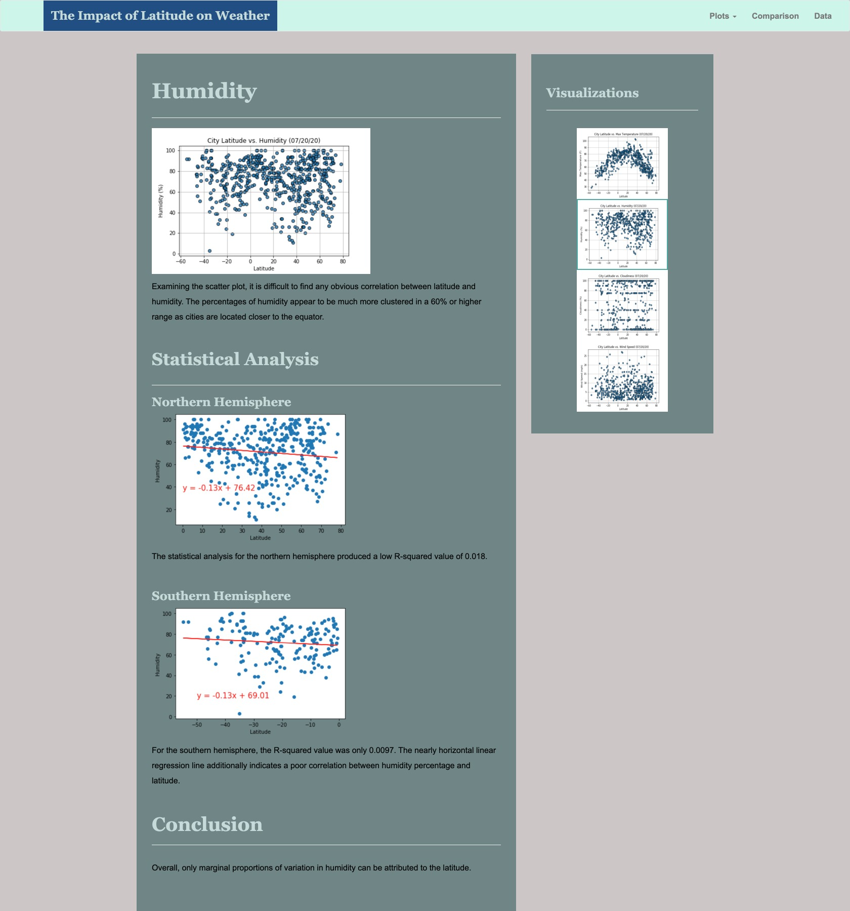
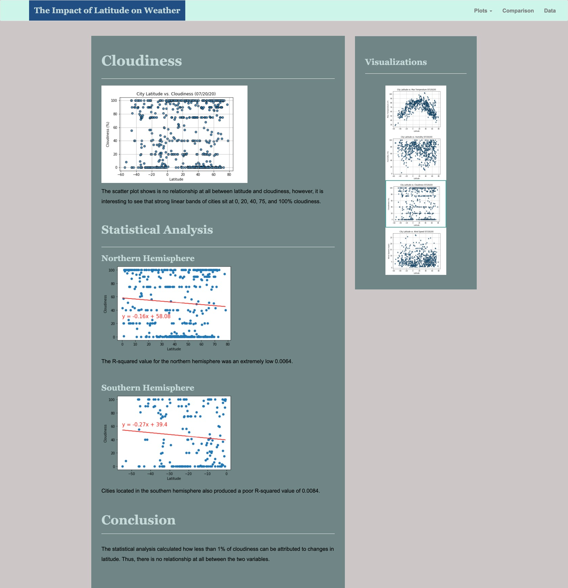
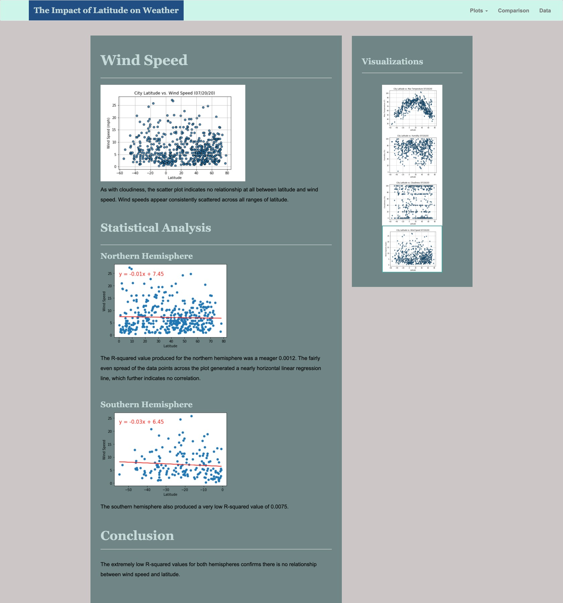
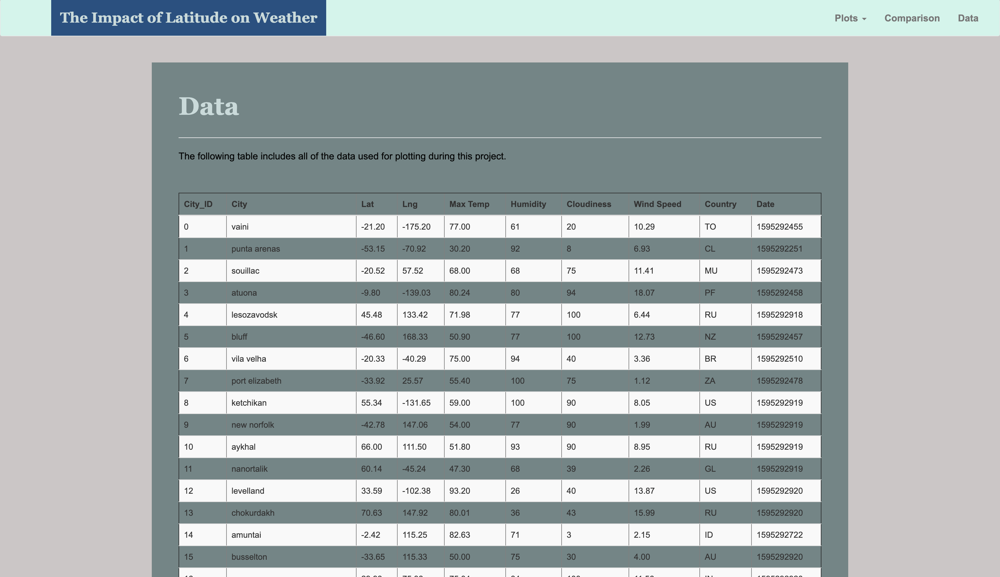

# City Latitude Weather Analysis Dashboard 

   

### Website: https://kiranrangaraj.github.io/City-Latitude-Weather-Analysis-Dashboard/

---

## Summary ##

A multipage visualization dashboard website was created using HTML5, CSS3, and Bootstrap to present the results from the City Latitude OpenWeatherMap API Analysis project. The project had analyzed how weather changes while getting closer to the equator. To accomplish the analysis, data was pulled from the OpenWeatherMap API to assemble a [dataset](Resources/cities.csv) on over 500 cities globally.

After assembling the dataset, Matplotlib was used to plot various aspects of the weather vs. latitude. These weather aspects were temperature, humidity, cloudiness, and wind speed. Northern and Southern hemispheres were then split into different datasets and linear regression plots were generated to provide a statistical analysis of the various weather factors.

The structure of the dashboard provides individual pages for each plot and a means by which to navigate between them. These pages contain the visualizations and corresponding explanations created in the prior project, in addition to a landing page, a page that compares all four plots, and a page that lists the raw API data that was used to build the plots.

---

## Website Parameters & Creation Process ##
The website contains 7 pages total and utilized HTML5, CSS, and Bootstrap. A navigation menu was created at the top of every page, and each page has the name of the site on the left side of the navbar that allows the user to return to the landing page from any page. A dropdown menu on the right of the navbar was created named 'Plots' that provides a link to each individual visualization page. HTML was coded to ensure responsiveness by any media queries.

The website includes: 
* A [landing page](#landing-page) containing:
   * Created a navigation bar with header, dropdown menu with links to each visualization page, comparison page and data page.
   * Created a home page with a project summary.
   * Created a sidebar containing preview images of each plot. Clicking an image takes the user to that visualization.
* Four [visualization pages](#visualization-pages), each containing:
   * Created a visualization page for each of the four visualizations - Latiude vs Max Temp, Humidity, Cloudiness, & Wind Speed.
   * Created a title and heading tag for each visualization page.
   * Added visualization for the selected comparison.
   * Added paragraph describing the plot and its significance.
* A [comparisons page](#comparisons-page) that:
   * Created a comparison page of all the visualizations to easily visually compare them.
   * Used a Bootstrap grid for the visualizations.
* A [data page](#data-page) that:
   * Used Python Pandas and OS to convert .csv file to HTML.
   * Created a data page that contains a responsive table of the data used in visualizations.

## Screenshots ##

### Landing page


### Comparisons page

### Four Visualization pages

#### Humidity

#### Cloudiness

#### Maximum Temperature

#### Wind Speed

### Data page

---

## Data Sources ##
* https://github.com/kiranrangaraj/Web-Design-Challenge/blob/master/Resources/cities.csv
* https://openweathermap.org/api

---

## Technologies Used ##
* PyCharm - Python IDE
* Jupyter Notebook
* Python - Pandas, OS
* HTML, CSS, Bootstrap

---

## Author ##
Kiran Rangaraj - Vanderbilt University 2020
* LinkedIn: [@Kiran Rangaraj](https://www.linkedin.com/in/kiranrangaraj/)
